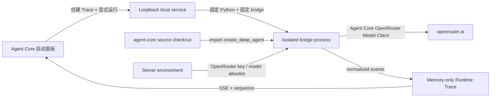

# Agent Core Execution V1

Agent Core Execution V1 把“接收外部 Trace”扩展为可选的真实独立 Agent 执行。网页创建内存 Trace 后，本地服务只启动仓库自带的固定桥接脚本；桥接脚本从指定的 `agent-core` checkout 导入 `openjiuwen.harness.create_deep_agent`，内部使用真实 `ReActAgent`、Rail callback、AbilityManager 和 Agent Core 自带的 OpenRouter Model Client。

它不是模拟器，也不会把一次普通 Chat Completions 请求标成 Agent。确定性 fixture、原始 OpenRouter Provider adapter 和真实 Agent Core executor 是三个独立模块。

## 模块与数据流



插件 `openjiuwen.agent-core-executor` 依赖：

- `openjiuwen.agent-core`：定义图、Core Runtime 协议和主链路；
- `openjiuwen.openrouter-provider`：首个 Provider 的模型注册与服务端凭据策略。

关闭任一依赖后，Executor 进入 `blocked`，页面不再展示启动入口。原始 Provider 与外部 Trace 采集能力仍可独立使用。

## Python 运行环境

本地服务本身继续只依赖 Python 标准库。Agent Core 的第三方依赖放在单独解释器中，不进入 Web 服务进程。

从 `visualization-web` 根目录创建环境：

```powershell
python -m venv .venv-agent-core
.\.venv-agent-core\Scripts\python.exe -m pip install -e '..\agent-core[observability]'
```

启动服务前配置：

```powershell
$env:OPENJIUWEN_AGENT_CORE_ROOT = (Resolve-Path "..\agent-core")
$env:OPENJIUWEN_AGENT_CORE_PYTHON = (Resolve-Path ".\.venv-agent-core\Scripts\python.exe")
$env:OPENJIUWEN_OPENROUTER_API_KEY = "<your-key>"
$env:OPENJIUWEN_OPENROUTER_MODELS = "openrouter/free"

python -B services/local-server/scripts/run_server.py `
  --allow-root (Resolve-Path "..") `
  --allow-origin "http://127.0.0.1:5173"
```

可选变量：

| Variable | Default | Purpose |
|---|---|---|
| `OPENJIUWEN_AGENT_CORE_ROOT` | `../agent-core` | Agent Core source checkout |
| `OPENJIUWEN_AGENT_CORE_PYTHON` | 启动本地服务的 Python | 安装了 Agent Core 完整依赖的解释器 |
| `OPENJIUWEN_AGENT_CORE_WORKSPACE` | `visualization-web/.agent-core-runtime` | DeepAgent 工作区和运行日志边界 |
| `OPENJIUWEN_AGENT_CORE_MAX_ITERATIONS` | `6` | ReAct 上限，服务强制限制在 2–20 |

普通状态读取复用 5 分钟的探测结果；`GET /api/v1/agent-core?refresh=1` 会在固定工作区中强制启动一次只导入、不调用模型的探测进程。冷启动最多等待 90 秒。状态明确区分：

- `ready`：Agent Core 导入成功且服务端 OpenRouter key 已配置；
- `unconfigured`：Python runtime 可用，但 OpenRouter key 缺失；
- `unavailable`：源码、解释器、bridge 或 Python 依赖不可用。

安装后可先运行不访问 OpenRouter 的真实框架自检：

```powershell
$env:PYTHONPATH = (Resolve-Path "..\agent-core")
.\.venv-agent-core\Scripts\python.exe -B services\local-server\scripts\agent_core_bridge.py --self-test
```

自检使用确定性模型替身，但实际创建并运行 `DeepAgent → ReActAgent → inspect_input → Rail → ContextWindow`；成功时最后一条前缀事件是 `trace.status/end`。该入口只用于本地验证，不对浏览器 API 开放。

## 真实执行边界

V1 调用：

```python
create_deep_agent(
    model=openrouter_model,
    tools=[inspect_input],
    rails=[VisualizationTraceRail()],
    enable_task_loop=False,
    parallel_tool_calls=False,
    enable_sys_operation=False,
)
```

- DeepAgent 是外层生命周期节点；内部 ReActAgent 是可展开的主分支。
- Model 由 Agent Core 的 `ModelClientConfig(client_provider="OpenRouter")` 创建。
- V1 只注册一个 `inspect_input` 工具。它只计算字符、行、词、代码围栏和 URL 标记，不读写仓库、文件、Git、shell 或网络。
- System prompt 要求模型先调用一次 `inspect_input` 再回答；实际是否发出 tool call 仍由所选上游模型能力决定，Trace 不会伪造未发生的调用。
- 未注册工具会由可观测 Tool allowlist Rail 发出 `block` 控制信号。
- `enable_task_loop=False` 表示当前是独立 Agent/ReAct 模式，不是 SwarmFlow，也不是 DeepAgent 外层长任务循环。

## 观测映射

`VisualizationTraceRail` 是真实注册到 DeepAgent 的 instrumentation Rail，priority 为 1000。它显式产生：

| Runtime event | Agent Core evidence |
|---|---|
| `agent.invoke` | DeepAgent `before_invoke / after_invoke` |
| `agent.user_message` | inner ReActAgent `on_user_message` |
| `model.call` | `before_model_call / after_model_call / on_model_exception` |
| `model.stream` | ReActAgent stream chunk inspector |
| `model.usage` | `AssistantMessage.usage_metadata` |
| `tool.call` | `before_tool_call / after_tool_call / on_tool_exception` |
| `agent.react_iteration` | `after_react_iteration` 成功边界 |
| `context.snapshot` | AFTER_MODEL_CALL 暴露的实际最终窗口，以及 invoke 结束后的 ModelContext |
| `context.delta` | Tool observation 进入 Context |
| `rail.hook` | instrumentation Rail 实际读取的载荷、mutation 和 control signal |
| `ability.register` | 固定 Tool allowlist 的真实注册意图 |

调用前 `ModelCallInputs.messages` 只是 preview。桥接只在 `after_model_call` 把 Agent Core 回填的最终 `ContextWindow` 标为实际发送窗口。每条消息保留完整 `raw`；`preview` 只做脱敏摘要。逐消息 Token 在模型返回前是明确标注来源的估算，时间轴累计量优先使用 Provider 的原生 usage。

Rail 深入画布优先显示 `hook.examines`，因此输入 Rail、Context Rail 和 Tool Rail 都能看到本次真实审查载荷；未提供 `exact=true` 的普通 callback chain 仍不会被页面猜成单 Rail 决策。

## Loopback API

| Method | Path | Purpose |
|---|---|---|
| `GET` | `/api/v1/agent-core` | 探测运行时、依赖、模型 allowlist 与固定工具 |
| `GET` | `/api/v1/agent-core?refresh=1` | 强制重新探测，用于安装依赖后刷新 |
| `POST` | `/api/v1/agent-core/invocations` | 使用开放 Core Trace 的 authority 启动 DeepAgent |
| `POST` | `/api/v1/agent-core/invocations/{id}/cancel` | 终止隔离进程并关闭 Trace |

启动请求与 OpenRouter Provider 使用相同的有界字段：`traceId`、`modelId`、`input`、可选 `systemPrompt` 和 `maxOutputTokens`。浏览器不能提交 Python 路径、命令、工具、Provider URL、header 或 API key。

取消时服务终止整个 bridge process，因此 Agent Core 的 asyncio 任务、OpenRouter HTTP 流和 Tool loop 一起结束。取消前已经进入 Trace 的事件保留，随后追加 `model.cancel` 与终止状态。桥接日志、异常正文、输入和凭据不会复制到错误元数据。

## 安全与容量

- 仅执行 repository-owned 固定 bridge script；API 不接受命令或脚本路径。
- `PYTHONPATH` 只由服务端配置的 Agent Core root 构造；浏览器无权覆盖。
- Bridge stdin 承载一次有界 JSON 请求；stdout 只接受带固定前缀的有界 JSON record，其他 Agent Core 日志全部丢弃。
- 同时最多两个 Agent Core invocation，同一 Trace 同时最多一个。
- Trace 仍只写进程内存；DeepAgent 自身需要的工作区和日志被限制到 `.agent-core-runtime/`。
- OpenRouter key 只继承自本地服务环境，不进入命令行、stdin、Trace 或前端。
- V1 不注册文件、shell、Git、MCP、Subagent 或写入工具。

## V1 非目标

- 不自动创建或更新 Python 环境；状态探测会给出明确缺失依赖。
- 不持久化 Agent session 或跨次调用复用 Context。
- 不启用 DeepAgent 外层 task loop、Subagent 或 SwarmFlow。
- 不保证所有 OpenRouter 模型都支持 tool calling；模型未调用工具时忠实展示直接回答分支。
- 不把 Agent Core 内部未显式暴露的默认 Rail 决策猜成精确事件。
