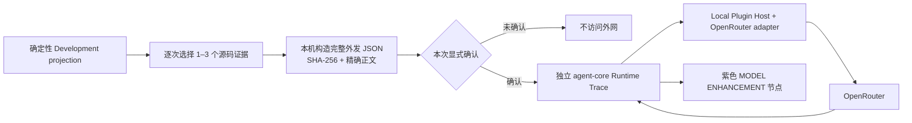

# Development OpenRouter Read-only Enhancement V1

## 目标与不可变边界

Development OpenRouter Enhancement 是确定性九步开发证据链上的可选建议分支。它不改变 `openjiuwen.deterministic-static-development` 的事实合同：基础 projection 仍保持 `modelAccess=false`、`repositoryWrite=false`，Session 中保存的仍是确定性结果。模型输出只能作为带 Provider、model、Trace、payload hash 和不确定性标记的旁支，不能覆盖源码证据、置信度、影响或不可应用 patch。



打开面板、读取 Provider 状态、选择源码和生成预览都只访问 loopback 本地服务。只有点击“确认并发送本次预览”才会创建调用并访问 OpenRouter。关闭面板不会授予后续调用；下一次必须重新选择、重新生成预览和重新确认。

## 精确外发内容

外发 body 与底层 OpenRouter Chat Completions adapter 的请求语义完全一致：

```json
{
  "model": "openrouter/free",
  "messages": [
    { "role": "system", "content": "只读开发分析约束与 JSON 输出合同" },
    { "role": "user", "content": "开发意图 + 结构化摘要 + 显式源码片段" }
  ],
  "max_tokens": 1024,
  "stream": true
}
```

页面在发送按钮之前完整显示该 JSON、固定 destination、字符数、源码数量和 SHA-256。实际 `startInvocation()` 参数由同一个 preview 对象生成；修改源码选择、模型或输出预算会立即使旧预览失效。API key、Authorization header 与 Host opaque secret handle 不进入预览或浏览器状态。

外发数据只包含：

| 数据 | 范围 |
|---|---|
| 开发意图 | 当前 Development 输入原文 |
| Repository | name、owner、branch、revision、dirty |
| 确定性摘要 | diagnosis、warning、证据身份/置信度、一阶 impact、结构化 change/test suggestion |
| Runtime 入口 | trace ID、sequence、event kind、phase、subject identity、Token 数；不含事件正文 |
| Definition 入口 | node identity 与聚合 span/event/token |
| Change 入口 | comparison、file status、impact kind/confidence/reason、hunk indexes 与可选 Runtime 聚合 |
| 源码 | 用户本次显式选择的 1–3 个 evidence；每个最多 64 行 / 8,000 字符，总计最多 24,000 字符 |

明确不外发完整 Context、Tool 参数/结果、Rail/Hook 输入输出、既有模型 delta/response、Runtime event details/payload、patch 正文、日志或 Development Session 完整 payload。所选源码本身可能包含敏感内容，因此完整 JSON 必须在确认前可滚动检查。

## 调用与结果投影

确认后页面创建一个独立 `agent-core` Runtime Trace，再通过现有 OpenRouter Provider endpoint 发送 preview 中的 system/user 文本。Provider 的固定域名、模型 allowlist、输入/输出限制、并发、重定向拒绝、SSE 校验、取消、Host lifecycle/network/secret gate 均保持不变。

流式事件映射到一个独立的 `DevelopmentEnhancementResult`：

- `model.stream` 按顺序追加模型原文；
- `model.usage` 展示真实 Token 和可用费用；
- Trace terminal 状态关闭运行中节点；
- 符合合同的 JSON 被解析为 diagnosis、change suggestions、test suggestions 和 caveats；
- 不符合结构合同的响应只保留为模型原文，不会被提升为结构化事实。

画布把结果作为紫色虚线分支挂在“诊断”节点上。点击节点可查看 model、source count、Trace ID、payload SHA-256、usage、结构化建议和模型原文。它不进入九步时间轴，也不修改基础节点或 Session projection。

## 本机保存与删除语义

模型调用沿用 Runtime Archive：外发 system/user 文本、流式输出和 usage 默认完整保存在本机 Runtime SQLite/WAL，UI 仍按 Archive 的脱敏/显式原文规则读取。Development Session 数据库不复制模型输入或输出；V1 也不在 Development Session 表和 Runtime Trace 之间建立外键。恢复历史 Development Session 只恢复确定性九步结果，不自动恢复或重放旧模型分支。

删除对应 Runtime Session 时，其模型输入、输出、Token 和事件一起级联删除。删除 Development Session 不会隐式删除独立 Runtime Session，避免两个存储平面产生不透明的跨表级联。

## 模块与能力

- `openjiuwen.development-assistant@0.3.0` 增加 `development.enhancement.openrouter.preview.v1`；
- `openjiuwen.openrouter-provider@0.2.0` 增加 `development.enhancement.readonly.v1`；
- 预览模型与边界函数位于 `features/development-assistant/enhancement.ts`；
- Provider、Source Reader 和 Runtime Trace 继续通过各自 adapter 使用，不把网络或仓库读取逻辑写进组件；
- OpenRouter 不作为 Development 基础插件的硬依赖，因此 Provider 关闭、阻止或未配置时，确定性 Development 与 Session 功能仍完全可用。

## V1 限制

- 不把模型结果持久化进 Development Session，也不支持 Session 恢复时自动关联 Archive Trace；
- 不运行目标仓测试、不生成可应用 patch、不修改文件、不执行 Shell/Git、不创建分支、commit 或 PR；
- 不支持把任意 Context、Tool、Rail、日志或手工粘贴附件加入外发载荷；
- 不声明模型建议正确；源码 revision 不匹配、dirty 和扫描 warning 会进入预览，由模型和用户自行判断；
- 停止调用只关闭上游流并保留已收到的部分输出，不回滚已经发送到 OpenRouter 的请求内容；
- OpenRouter 及其实际上游模型如何处理已发送数据，受对应服务策略约束。
