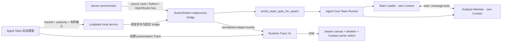

# JiuwenSwarm Agent Team Execution V1

JiuwenSwarm Agent Team Execution V1 在既有 Swarm Runtime Trace 之上增加一个可开关的真实执行模块。网页先创建 `owner=jiuwenswarm` 的实时 Trace 与归档 Session，本地服务再启动仓库自带的固定子进程 bridge。Bridge 从指定的两个 source checkout 导入：

- `jiuwenswarm.agents.swarm.enrich_team_spec_for_swarm`，负责应用 JiuwenSwarm provider assembly；
- Agent Core `TeamAgentSpec`、`Runner.run_agent_team_streaming` 与 `TeamMonitor`，负责真实团队生命周期、成员运行和团队事件。

V1 是固定两成员 Agent Team，不是 SwarmFlow。`enable_swarmflow=False` 同时出现在规范、无凭据运行时描述和 Trace 起始事件中；只有未来真正接入 Workflow engine 时才允许把链路标记为 SwarmFlow。

## 模块与数据流



`openjiuwen.jiuwenswarm-executor` 依赖：

- `openjiuwen.jiuwenswarm`：Swarm Runtime source、主体层级、Context owner 与画布；
- `openjiuwen.openrouter-provider`：服务端凭据策略和模型白名单。

插件关闭只移除网页执行入口，不会停止已经在外部启动的 local service，也不会改变基础 Trace ingestion 合同。

## 固定团队 Profile

V1 的团队形状不接受浏览器覆盖：

| Field | Fixed value |
|---|---|
| profile | `predefined-two-member` |
| team mode | `predefined` |
| dispatch mode | `scheduled` |
| spawn mode | `inprocess` |
| lifecycle | `temporary` |
| members | `team_leader` + `analyst` |
| SwarmFlow | disabled |
| HITT / external CLI / bridge member | disabled |
| MCP / Subagent / Skill discovery | disabled |
| Context ownership | one owner per member |
| active invocation limit | one process |

Leader 收到原始用户任务，创建一个指派给 `analyst` 的有界任务，等待成员完成后综合结果。运行时生成 team name、session id、workspace 与 invocation id；浏览器不能指定这些身份，也不能提供 Python 路径、命令、工具、Provider URL、header 或 API key。

## 实际 Tool 边界

Agent Core Team harness 会在内部注册一组通用 DeepAgent 和团队资源。V1 不把“已注册资源”误当成“模型可调用工具”：Bridge 的最后一个 `before_model_call` Rail 会按成员角色重写最终 Tool schema，模型实际只看到以下集合。

| Role | Model-visible tools |
|---|---|
| Leader | `create_task`, `view_task`, `send_message` |
| Analyst | `view_task`, `send_message`, `member_complete_task` |

同一个 Rail 在 `before_tool_call` 再执行一次 deny 检查。即使未来上游 Rail 意外重新引入 schema，文件、Shell、Git、Skill、MCP、Subagent、动态组队、SwarmFlow 和异步后台工具也不会执行。过滤动作本身会进入 `rail.hook`，`ability.register` 只记录最终模型可见集合。

确定性自检会硬性断言 Leader 的实际 `ability.register` 恰好等于三个允许工具；出现额外工具时自检失败。

## Context 与事件映射

每个非终止事件都带稳定 `subject`。成员 subject 同时声明 `parentId=team subject` 和独立 `contextOwnerId`。

| Runtime event | Evidence source |
|---|---|
| `swarm.team` | provider assembly、`team.runtime_ready`、TeamMonitor 快照和停止结果 |
| `swarm.member` | TeamMonitor roster/status + 成员 DeepAgent invoke Rail |
| `swarm.task` | TeamMonitorHandler task conversion / task snapshot |
| `swarm.message` | TeamMonitorHandler message conversion |
| `agent.invoke` | 成员 `before_invoke` / `after_invoke` |
| `agent.user_message` | 成员 `on_user_message` |
| `agent.react_iteration` | 成员 `after_react_iteration` |
| `rail.hook` | Bridge 显式成员 Rail callback |
| `ability.register` | 经过角色 allowlist 后的实际 Model call Tool schema |
| `model.call` / `model.stream` / `model.usage` | Agent Core model callback 与 stream inspector |
| `tool.call` | 允许工具的真实执行，或 deny boundary |
| `context.delta` | 输入进入指定成员 Context |
| `context.snapshot` | `after_model_call` 的实际发送窗口和成员最终窗口 |

Context message 的 `raw` 保存完整处理文本，`preview` 是脱敏摘要。页面的消息分段模式默认展示 preview、逐条展开 raw；连续原文模式始终按当前 owner 展示完整消息并跟随新内容。成员窗口不会合并为一个虚构的团队 Context。

## API

### Registry

```http
GET /api/v1/jiuwenswarm?refresh=1
```

返回无凭据描述：固定 profile、是否为 SwarmFlow、Context ownership、实际 Tool allowlist、模型白名单、容量和诊断。`refresh=1` 重新运行导入探测；普通读取使用有 TTL 的探测缓存。

### Start

```http
POST /api/v1/jiuwenswarm/invocations
Content-Type: application/json
X-Trace-Token: <write token>
```

```json
{
  "traceId": "tr_...",
  "modelId": "openrouter/free",
  "input": "分析这条执行链并报告关键决策",
  "systemPrompt": "可选的 Leader 补充约束",
  "maxOutputTokens": 512
}
```

Trace 必须由 `owner=jiuwenswarm` 创建，模型必须位于服务端 allowlist。请求中出现任何未声明字段都会被拒绝。

### Cancel

```http
POST /api/v1/jiuwenswarm/invocations/{id}/cancel
X-Trace-Token: <write token>
```

取消会终止整个 bridge process，保留已接收的 Team、Member、Task、Message、Rail、Model、Tool 与 Context 证据，再追加团队取消和 Trace 终止事件。Bridge 日志、异常正文、输入与凭据不会复制到错误元数据。

## 环境配置

| Variable | Default | Purpose |
|---|---|---|
| `OPENJIUWEN_JIUWENSWARM_ROOT` | `../jiuwenswarm` | JiuwenSwarm source checkout |
| `OPENJIUWEN_AGENT_CORE_ROOT` | `../agent-core` | Agent Core source checkout |
| `OPENJIUWEN_JIUWENSWARM_PYTHON` | `OPENJIUWEN_AGENT_CORE_PYTHON` 或服务 Python | 可导入两个框架依赖的解释器 |
| `OPENJIUWEN_JIUWENSWARM_WORKSPACE` | `.jiuwenswarm-runtime/` | 每次调用的服务端 workspace 根 |
| `OPENJIUWEN_JIUWENSWARM_MAX_ITERATIONS` | `8` | 每个成员的 ReAct 上限，范围 `2..20` |
| `OPENJIUWEN_OPENROUTER_API_KEY` | 无 | 服务端 OpenRouter key |
| `OPENJIUWEN_OPENROUTER_MODELS` | `openrouter/free` | 模型 allowlist |

Source checkout 由服务端组装进子进程 `PYTHONPATH`；不会修改两个上游仓。解释器仍需具备它们声明的运行依赖，包括 Agent Team 默认 SQLite driver。

可以先运行不访问 OpenRouter 的真实框架自检：

```powershell
$env:PYTHONDONTWRITEBYTECODE = "1"
$env:PYTHONPATH = "C:\path\to\jiuwenswarm;C:\path\to\agent-core"
& $env:OPENJIUWEN_JIUWENSWARM_PYTHON -B `
  services/local-server/scripts/jiuwenswarm_bridge.py --self-test
```

自检会实际执行 provider assembly、Team Runner、TeamMonitor、成员 DeepAgent、Rail、Model callback 与 Context 归一化，但使用进程内确定性模型，不访问模型 API。

## V1 限制

- 固定 roster，不提供网页端成员编辑器或动态 spawn。
- 确定性自检验证真实团队基础设施和 roster；它不伪造一次模型驱动的任务委派。实时 OpenRouter 运行才由 Leader 选择允许的团队工具。
- 只支持 in-process scheduled Agent Team；process/remote transport 是未来独立 profile。
- 不启用 SwarmFlow、HITT、外部 CLI Agent、MCP、Skill、Subagent 或任意仓库工具。
- Trace 的实时 authority 只保存在 local service 内存中；完整 Context 和归一化事件同步进入本机运行归档。团队自身的临时数据库和 workspace 位于忽略的运行目录。
- 输入发送到 OpenRouter 后的数据处理同时受 OpenRouter 与实际上游模型的策略约束。
