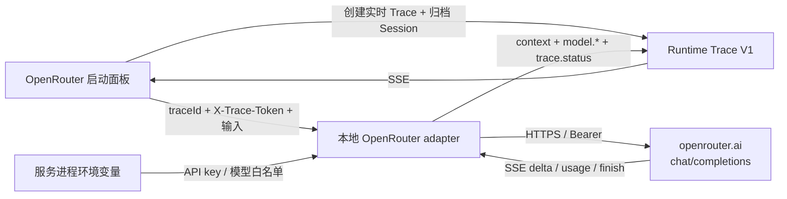

# OpenRouter Provider V1

OpenRouter 是首个真实 Model Provider。V1 提供一个可开关的 `openjiuwen.openrouter-provider` 插件：本地服务独占 API key、维护模型 allowlist，并提供固定域名的 provider-only 调用合同。这个底层 adapter 不是完整 Agent 执行器；真实 DeepAgent、真实两成员 Agent Team、真实固定 SwarmFlow 与真实 TaskTool Subagent 分别由依赖它的 `openjiuwen.agent-core-executor`、`openjiuwen.jiuwenswarm-executor`、`openjiuwen.swarmflow-executor` 和 `openjiuwen.subagent-executor` 提供，见 [`agent-core-execution-v1.md`](agent-core-execution-v1.md)、[`jiuwenswarm-execution-v1.md`](jiuwenswarm-execution-v1.md)、[`swarmflow-execution-v1.md`](swarmflow-execution-v1.md) 与 [`subagent-execution-v1.md`](subagent-execution-v1.md)。

## 数据流与权限边界



- API key 只从本地服务进程环境读取，不进入 React state、请求正文、API 响应、Trace、日志、插件偏好或磁盘。模型输入与输出作为 Runtime 事件进入本机归档，但 key 永不进入事件。
- 浏览器仍持有当前 Trace 的高熵写入令牌；Provider endpoint 必须用它证明本次调用属于一个开放的 `agent-core` Trace。
- Provider URL 固定为 `https://openrouter.ai/api/v1/chat/completions`，拒绝重定向，不接受浏览器提供 base URL。
- 插件关闭后，Provider contribution 消失，依赖它的 Agent Core、JiuwenSwarm、SwarmFlow 与 Subagent Executor 都进入 blocked；本地服务不会因此卸载，也不会自动发起请求。

## 服务端配置

启动本地服务前设置环境变量：

| Variable | Required | Purpose |
|---|---:|---|
| `OPENJIUWEN_OPENROUTER_API_KEY` | 是 | 首选的项目级 API key；也兼容官方常用的 `OPENROUTER_API_KEY` |
| `OPENJIUWEN_OPENROUTER_MODELS` | 否 | 逗号分隔的模型 allowlist；缺省仅注册 `openrouter/free` |
| `OPENJIUWEN_OPENROUTER_DEFAULT_MODEL` | 否 | 默认模型，必须存在于 allowlist |
| `OPENJIUWEN_OPENROUTER_SITE_URL` | 否 | 映射为 OpenRouter 可选 `HTTP-Referer` header |
| `OPENJIUWEN_OPENROUTER_APP_NAME` | 否 | 映射为可选 `X-OpenRouter-Title` header |

PowerShell 示例：

```powershell
$env:OPENJIUWEN_OPENROUTER_API_KEY = "<your-key>"
$env:OPENJIUWEN_OPENROUTER_MODELS = "openrouter/free,openrouter/auto"
$env:OPENJIUWEN_OPENROUTER_DEFAULT_MODEL = "openrouter/free"
python -B services/local-server/scripts/run_server.py `
  --allow-root "C:\path\to\OpenJiuwen_Visualization" `
  --allow-origin "http://127.0.0.1:4173"
```

`openrouter/auto` 可能路由到付费模型；页面不会依据模型名推断价格。实际费用只采用 OpenRouter 最终 usage 中的 `cost`，转换为整数 `costMicros` / `USD`。

## Loopback API

| Method | Path | Purpose |
|---|---|---|
| `GET` | `/api/v1/model-providers/openrouter` | 读取无凭据的状态、模型 allowlist、默认模型和本地上限 |
| `POST` | `/api/v1/model-providers/openrouter/invocations` | 校验 Trace authority 后异步启动流式调用 |
| `POST` | `/api/v1/model-providers/openrouter/invocations/{id}/cancel` | 用同一个 Trace token 请求取消并关闭上游流 |

启动请求只接受：

```json
{
  "traceId": "tr_...",
  "modelId": "openrouter/free",
  "input": "用户输入原文",
  "systemPrompt": "可选 system 原文",
  "maxOutputTokens": 512
}
```

调用 endpoint 返回 `202 Accepted` 与高熵 invocation ID；生成过程通过既有 `/api/v1/traces/{id}/stream` 到达页面，不把 OpenRouter SSE 直接暴露给浏览器。

## Trace 投影

一次成功调用依次写入：

1. `agent.user_message`：只标记输入边界，不复制正文；
2. `context.snapshot`：保存 system/user 完整原文，分段视图默认脱敏，连续原文保持完整；
3. `model.call/start`：记录 Provider、请求模型和输出预算；
4. 零到多个 `model.stream`：每个 OpenRouter 文本 delta 保持原顺序；
5. `model.usage`：记录原生输入/输出/缓存/推理 Token 与可用的精确费用；
6. `model.call/end`：记录 finish reason、实际路由模型和 generation ID；
7. `context.delta`：把最终 assistant 原文追加到 Context；
8. `trace.status/end`：关闭会话。

取消会关闭当前上游 response，保留已收到的 delta，将部分 assistant 输出加入 Context，再写入 `model.cancel` 与终止状态。网络、协议、认证、额度或上游错误写入 `model.call/error` 和 `trace.status/error`；错误元数据只保存稳定类型，不把可能包含输入的上游错误正文放到 Provider 元数据。

Context 卡片的逐消息 Token 在请求发出前只能是字符级估算，`source` 会显式标注 `estimated tokens`。Model usage 和时间轴总量采用 OpenRouter 返回的原生 tokenizer 结果，不用本地估算覆盖真实 usage。

## 有界执行

- 输入最多 64,000 字符，system prompt 最多 32,000 字符；输出预算为 16–4,096 Token。
- 同时最多 4 个调用；同一 Trace 同时只允许一个 OpenRouter invocation。
- SSE 最多 4,096 个数据帧、8 MiB、单行 1 MiB、累计文本 1,000,000 字符。
- 手写 SSE parser 支持注释 keepalive、多行 `data:`、`[DONE]` 和最终 usage；无效 UTF-8/JSON、异常 content type 或超限都会安全终止 Trace。
- 服务拒绝目标重定向，使用系统 TLS 校验；不记录 prompt、模型输出或 API key。
- Trace authority 与实时 Context 状态仍只在服务内存中，进程退出或 TTL/容量回收后不能继续；完整归一化事件同步保存在本机归档。发送到 OpenRouter 后的数据处理同时受 OpenRouter 与实际上游模型的策略约束。

协议依据 OpenRouter 官方当前文档：[`POST /api/v1/chat/completions`](https://openrouter.ai/docs/api/api-reference/chat/create-a-chat-completion)、[Streaming](https://openrouter.ai/docs/api_reference/streaming)、[Usage Accounting](https://openrouter.ai/docs/cookbook/administration/usage-accounting) 与 [Errors](https://openrouter.ai/docs/api_reference/errors-and-debugging)。

## V1 非目标

- provider-only adapter 本身不做多轮会话持久化、自动 Tool loop、Subagent 或 Swarm 调度；这些生命周期只能由独立 Executor 明确拥有；
- 不从浏览器新增任意模型、Provider、URL、header 或采样参数；
- 不管理 OpenRouter key、余额、模型价格或账号设置；
- 不把 live 调用伪装成确定性 replay；既有录制演示继续独立存在。
