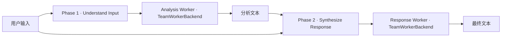
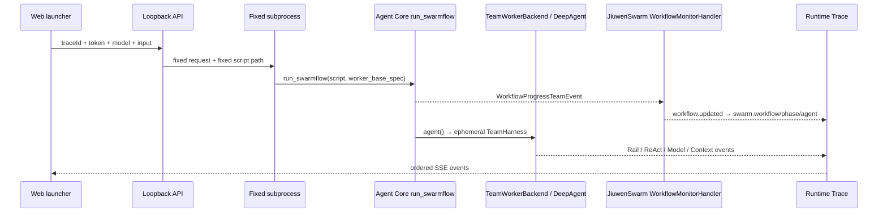

# Agent Core SwarmFlow Executor V1

SwarmFlow Executor V1 是独立于 JiuwenSwarm Agent Team 和 Agent Core Subagent 的真实运行能力。它执行仓库拥有的固定两阶段工作流，通过 Agent Core `run_swarmflow` 与 `TeamWorkerBackend` 创建临时 Worker，再让 JiuwenSwarm `WorkflowMonitorHandler` 聚合结构化进度。浏览器不上传或生成 Python 工作流代码。

## 产品身份

| 能力 | Agent Team | SwarmFlow V1 | Subagent V1 |
|---|---|---|---|
| 主要结构 | Leader / Member / Task / Message | Workflow / Phase / ephemeral Worker | Parent dispatcher / child Agent |
| 调度 | scheduled team coordination | 固定串行 author phases | 固定前台单 child |
| 执行主体 | roster member | 每个 `agent()` 一次性 TeamHarness | 父/子两个 DeepAgent |
| Context | per-member | per-agent | parent/child 分离 |
| V1 Tool | 角色团队工具 | 无模型可见 Tool | 父 `task_tool` / child 只读 Tool |
| capability | `runtime.jiuwenswarm.execute.v1` | `runtime.swarmflow.execute.v1` | `runtime.subagent.execute.v1` |

页面使用蓝绿色 SwarmFlow 入口，与紫色 Agent Team、橙色 Subagent 明显区分；运行证据仍进入统一 Swarm Trace，因此可以复用宏观/微观层级画布、实时磁吸、拖拽缩放、时间轴和右侧 ContextWindow。

## 固定工作流

规范脚本位于 `services/local-server/scripts/workflows/swarmflow_v1.py`，形状固定为：



- `Analysis Worker` 接收完整用户输入与可选回复指导，提取意图、约束和必须保留的事实；
- `Response Worker` 接收完整用户输入、相同回复指导和上一阶段的完整文本结果；
- 两个 `agent()` 串行执行，不开启 `parallel`、`agent_session`、`human` 或 HITL；
- 每次调用创建独立、一次性的 `TeamHarness` Worker，执行真实 DeepAgent/ReAct 后释放；
- 阶段名、Worker label、转移顺序和脚本路径都不能从网页修改。

可选 `systemPrompt` 只作为两个阶段 prompt 中的附加回复指导，不能覆盖 roster、phase、Tool、workspace、模型 allowlist 或 Rail 策略。

## 真实事件链



状态来源有两层，职责不混淆：

1. Agent Core `WorkflowObserver` 接收原生 `WorkflowProgressEvent`；bridge 逐字段构造 `WorkflowProgressTeamEvent`，不解析日志文本；
2. JiuwenSwarm `WorkflowMonitorHandler` 与 `WorkflowRunState` 生成 workflow/phase/agent 聚合状态，再映射为 `swarm.*` 生命周期事件。

`log()` 只作为工作流叙述进入聚合器。Phase 和 Worker 状态、失败、完成与计数都不从日志或 output 猜测。

## Context、Model 与 Rail

每个 Worker 拥有稳定且独立的 `contextOwnerId`。事件包括：

- `agent.user_message` 与 `context.delta`：阶段 prompt 进入该 Worker；
- `rail.hook/on_user_message`：显示 Rail 实际审查的输入分块；
- `rail.hook/before_model_call.tool_boundary`：显示进入边界的 Tool schema 与被移除项；
- `rail.hook/before_model_call`：显示最终模型窗口中被审查的消息内容；
- `model.call`、`model.stream`、`model.usage`：保留真实 Provider、流增量和 usage；
- `context.snapshot`：保存实际发送给模型的完整消息原文；
- `agent.react_iteration`：记录真实 Model/Observation 周期；
- Worker 完成后再写一次包含 assistant response 的完整最终 Context。

Context 分段模式默认使用 `preview`，逐条展开显示完整 `raw`；连续原文模式读取同一批完整消息并自动跟随新增内容。两个 Worker 的 owner 不会合并，所以第二阶段收到的第一阶段文本只出现在其自己的 prompt/Context 中，不会把两个窗口伪装成共享会话。

Agent Core 在 DeepAgent 装配期间可能创建框架内建能力资源；SwarmFlow V1 的最终 `before_model_call` Rail 始终把模型可见 `tools` 收敛为空，`before_tool_call` 对任何意外调用执行第二次 deny。运行时 descriptor 因而声明 `tools: []`，含义是“此 profile 没有可见或可执行工具”，不是声称框架内部从未构造资源。

## 插件与前端模块

- 插件：`openjiuwen.swarmflow-executor`；
- capability：`runtime.swarmflow.execute.v1`；
- 依赖：`openjiuwen.agent-core`、`openjiuwen.jiuwenswarm`、`openjiuwen.openrouter-provider`；
- adapter：`src/adapters/swarmflow-runtime/`；
- feature：`src/features/swarmflow-execution/`；
- local service：`swarmflow_runtime.py`；
- bridge：`swarmflow_bridge.py`；
- 固定 profile：`scripts/workflows/swarmflow_v1.py`。

模块关闭后入口消失；依赖关闭时模块进入 blocked。Agent Team、SwarmFlow 和 Subagent 三个 Swarm 执行器互斥，防止同一页面同时创建多个活跃进程和 Trace 归属歧义。

## Loopback API

### Registry

```http
GET /api/v1/swarmflows
GET /api/v1/swarmflows?refresh=1
```

响应声明固定 profile、两阶段清单、OpenRouter 模型 allowlist、运行上限与无凭据诊断。API key、源代码绝对路径和 Python 命令不会返回浏览器。

### Start

```http
POST /api/v1/swarmflows/invocations
Content-Type: application/json
X-Trace-Token: <write token>
```

请求只接受：

```json
{
  "traceId": "tr_...",
  "modelId": "openrouter/free",
  "input": "需要处理的完整文字",
  "systemPrompt": "可选回复指导",
  "maxOutputTokens": 512
}
```

任何额外字段都会被拒绝，包括 script、path、phase、agent、tool、parallel、human 或 provider URL。服务端追加 `teamName`、`sessionId`、`runId`、固定脚本路径、workspace 和 Trace 预算，再启动一次隔离子进程。

### Cancel

```http
POST /api/v1/swarmflows/invocations/{id}/cancel
X-Trace-Token: <write token>
```

取消终止整个 bridge process，保留已收到的 Workflow/Phase/Worker/Rail/Model/Context 证据，再追加 workflow、runtime container 与 Trace 的取消事件。调用完成后不能再次取消。

## 受管环境配置

SwarmFlow 与 JiuwenSwarm Agent Team 共用网页管理的 `swarm-core-env`。用户在“连接”中绑定 JiuwenSwarm 仓、检查其 Core 依赖并创建环境，然后从运行面板启动；无需设置 Python/source 环境变量。

Git/registry Core 由 JiuwenSwarm 的精确 lock 安装结果提供，不会被 standalone Agent Core slot 或 Companion `PYTHONPATH` 覆盖；本地 path Core 只使用依赖检查得到的精确路径。首次调用前自动对账；Agent Team 或另一 SwarmFlow 正在使用环境时只能复用同一 generation。运行面板及 Trace 首事件显示 fingerprint、Python/uv、JiuwenSwarm revision 和 Core lock identity。

bridge 把 Agent Core 本地状态、journal、Worker workspace 与临时目录都放在本次 invocation workspace 下。源码仓保持只读，浏览器不能覆盖路径。Trace authority 与实时播放状态只在 local service 内存中，完整归一化事件与 Context 同步进入本机运行归档。完整环境合同见 [`managed-environments-v1.md`](managed-environments-v1.md)。

## 无网络真实框架自检

开发者拥有可导入两个框架的解释器时可以直接运行自检；该命令不是普通用户的配置或启动方式：

```powershell
$env:PYTHONDONTWRITEBYTECODE = "1"
$env:PYTHONPATH = "C:\path\to\jiuwenswarm;C:\path\to\agent-core"
& ".\.venv-agent-core\Scripts\python.exe" -B `
  services/local-server/scripts/swarmflow_bridge.py --self-test
```

自检不访问 OpenRouter，但实际执行：

- `Runner.start/stop`；
- `run_swarmflow` 与固定脚本加载/日志/phase；
- 两次 `TeamWorkerBackend → TeamHarness.run_once → DeepAgent`；
- Rail callback、模型流、usage、ReAct 与最终 Context；
- `WorkflowProgressTeamEvent → WorkflowMonitorHandler → WorkflowRunState`；
- Team → Workflow → 两个 Phase → 两个 Agent 的层级与两个独立 owner；
- terminal Trace event。

确定性模型只替换网络 client，不替换上述框架路径。服务测试覆盖 registry、封闭请求、事件透传、Trace authority、容量和取消；前端测试覆盖严格 response shape、启动/取消请求和插件依赖。

## V1 限制

- 只支持仓内固定两阶段脚本；没有 workflow 编辑器、仓库自动生成工作流或任意配置上传；
- 只支持串行两个 Worker；没有 parallel、branch retry UI、动态 phase、nested workflow 或 session avatar；
- 不支持 Human-in-the-loop、暂停/恢复或 journal resume UI；
- WorkflowProgress 本身仍没有结构化 Tool activity；本 profile 同时禁止全部 Worker Tool，因此不会从日志制造 Tool 节点；
- OpenRouter 是首个 Provider；输入发送后的数据处理受 OpenRouter 与实际上游模型策略约束；
- 一次最多一个 SwarmFlow invocation，取消按完整进程树处理；
- 实时 Trace authority 不跨服务重启恢复；完整事件、Context 与模型输出仍按 Runtime Archive 合同保存在本机，并可做结构化跨运行比较。
